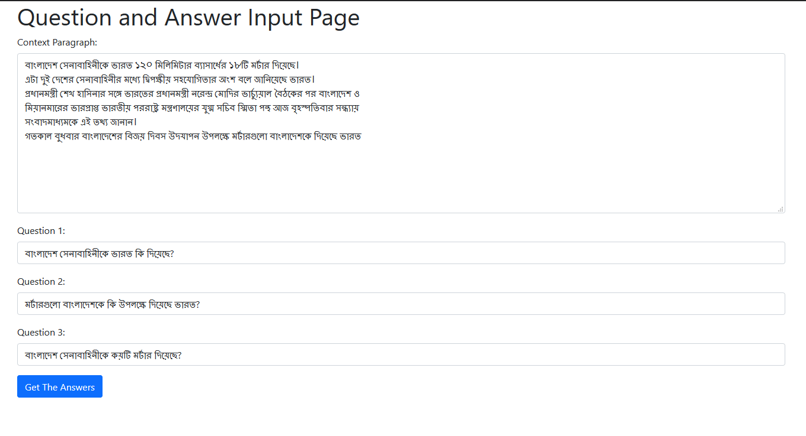
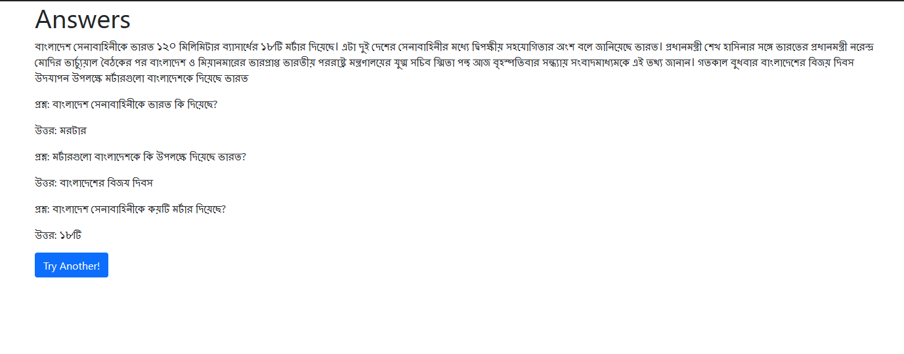

# Prosnottor (প্রশ্নোত্তর)

Prosnottor is a frontend for a Bengali language model that can answer questions 
from a given context paragraph. 

## Cool, where can I get the model? 

As you might have guessed, I don't have the brains to do NLP and/or Machine
Learning. [Arnab Saha](https://github.com/arnabsaha007) has given me the model to create an interface for it. If s/he 
decides to publish the model someday, I'll be happy to link it here. Thank you!

## Where's the demo? 

Too poor to host. Wanna sponsor a server? Pls mailto: optical.mahir@gmail.com

### For now screenshots have to substitute:

Context and Question input page: 

Answers Page: 